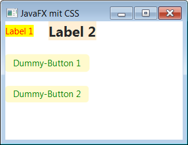

# JavaFX with CSS

This repository contains a simple [JavaFX](https://en.wikipedia.org/wiki/JavaFX) program that uses CSS.

<br>

The repository contains two batch scripts to compile and run the program under Windows:

````
    build.bat
    run.bat
````    

<br>

----
## Screenshot



<br>

----
## License

See the [LICENSE file](LICENSE.md) for license rights and limitations (BSD 3-Clause License)
for the files in this repository.
